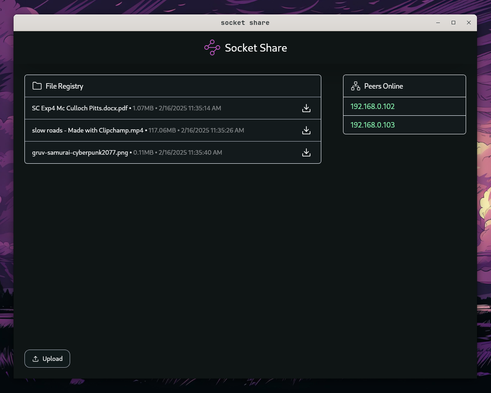

### Socket Share - Share Files on Local Network

---

Socket Share is a peer-to-peer file-sharing desktop application that enables reliable file transfers over local networks without internet dependency.

Socket Share uses a decentralized file index to list files uploaded by users and UDP broadcasts to instantly synchronize file index and discover available peers.

---

Preview:

